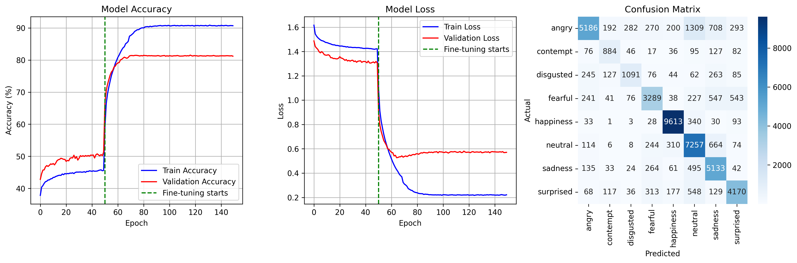

# 🎭 Real-Time Facial Emotion Recognition

> End-to-end deep learning system classifying **8 facial emotions** in real time using EfficientNet-B0 transfer learning, dual PyTorch & TensorFlow pipelines, and live webcam inference.


---

## 📋 Table of Contents

- [Overview](#-overview)
- [Results](#-results)
- [Architecture](#-architecture--training)
- [Dataset](#-dataset)
- [Installation](#-installation)
- [Training](#-training)
- [Real-Time Demos](#-real-time-demos)
- [Repository Structure](#-repository-structure)
- [Tech Stack](#-tech-stack)
- [What I Learned](#-what-i-learned)
- [Future Work](#-future-work)

---

## 🔍 Overview

This project builds a complete **facial emotion recognition pipeline** from scratch — from dataset preparation and GPU-optimized training to live webcam inference and an animated robot face UI.

**8 emotion classes:** `angry` · `contempt` · `disgusted` · `fearful` · `happiness` · `neutral` · `sadness` · `surprised`

**Key highlights:**
- Transfer learning with **EfficientNet-B0** and **ResNet-50** (PyTorch & TensorFlow)
- Two-phase training strategy: frozen backbone → full fine-tuning
- **~82% validation accuracy** on 8-class emotion classification
- Real-time webcam inference at interactive frame rates
- Pygame-based animated **robotic face** UI driven by live emotion predictions
- DeepFace library used as a quantitative baseline

---

## 📊 Results

### Training Curves

| Phase | Epochs | Strategy | Val Accuracy |
|-------|--------|----------|-------------|
| Phase 1 | 0 – 49 | Frozen backbone, train head only | ~45% |
| Phase 2 | 50 – 149 | Full fine-tuning, lower LR | **~82%** |

> Fine-tuning at epoch 50 causes a sharp jump in both accuracy and loss convergence — clearly visible in `results/pytorch_training_results.png`.

**Final metrics (EfficientNet-B0, PyTorch):**

| Metric | Value |
|--------|-------|
| Peak Validation Accuracy | **~81–82%** |
| Final Train Accuracy | ~91% |
| Final Validation Loss | ~0.59 |
| Final Train Loss | ~0.20 |
| Total Epochs | 150 |

### Per-Class Performance

Derived from the confusion matrix on the test set:

| Emotion | Correct | Notes |
|---------|---------|-------|
| 😊 happiness | **9,613** | Highest accuracy — most distinctive features |
| 😐 neutral | **7,257** | Strong, minor leak into sadness |
| 😢 sadness | **5,133** | Some confusion with neutral |
| 😠 angry | **5,186** | Frequent misclassification as neutral (1,309) |
| 😨 fearful | **3,289** | Confused with sadness and surprised |
| 😲 surprised | **4,170** | Overlaps with fearful |
| 🤢 disgusted | **1,091** | Hardest class — confused with angry |
| 😒 contempt | **884** | Subtle expression, fewest samples |

### Confusion Matrix

```
              angry  contempt  disgust  fearful  happy  neutral  sadness  surprised
angry          5186       192      282      270    200     1309      708        293
contempt         76       884       46       17     36       95      127         82
disgusted       245       127     1091       76     44       62      263         85
fearful         241        41       76     3289     38      227      547        543
happiness        33         1        3       28   9613      340       30         93
neutral         114         6        8      244    310     7257      664         74
sadness         135        33       24      264     61      495     5133         42
surprised        68       117       36      313    177      548      129       4170
```

**Key observations:**
- **Happiness** and **neutral** dominate the diagonal — the model is most confident here
- **Angry → Neutral** is the single largest off-diagonal error (1,309 cases) — both are low-arousal negative expressions
- **Disgust** and **contempt** are the most challenging — subtle, visually similar expressions with fewer training samples
- **Fearful ↔ Surprised** confusion is expected given their shared high-arousal characteristics



---

## 🧠 Architecture & Training

### Model Pipeline

```
Input (224×224 RGB)
       ↓
Data Augmentation
  ├── Random Horizontal Flip
  ├── Random Resized Crop
  ├── Color Jitter
  └── ImageNet Normalization
       ↓
EfficientNet-B0 Backbone (ImageNet pretrained)
       ↓
Global Average Pooling → 1280-dim feature vector
       ↓
Dropout (p=0.3)
       ↓
Linear Classifier → 8 classes
       ↓
Softmax Output
```

### Two-Phase Training Strategy

**Phase 1 — Classifier Warmup (Epochs 0–49)**
- Backbone weights are **frozen**
- Only the classifier head is trained
- Higher learning rate (`1e-3`)
- Prevents destroying pretrained features before the head is stable
- Saves checkpoint: `models/best_model_phase1.pth`

**Phase 2 — Full Fine-Tuning (Epochs 50–149)**
- **All layers unfrozen** and updated end-to-end
- Lower learning rate (`1e-4`) to avoid catastrophic forgetting
- `ReduceLROnPlateau` scheduler monitors validation loss
- Validation accuracy jumps from ~45% → **~82%**
- Saves checkpoint: `models/best_model_final.pth`

### TensorFlow/Keras Pipeline

An independent TensorFlow pipeline (`src/train_tensorflow.py`) implements the same strategy with:
- **EfficientNetB0**, **EfficientNetB3**, and **ResNet50** backbones
- `ImageDataGenerator` with `validation_split=0.2`
- Callbacks: `ReduceLROnPlateau`, `EarlyStopping`, `ModelCheckpoint`
- Exports: `results/best_model.h5` → `results/emotion_model_final.h5`

---

## 📂 Dataset

The pipeline expects the following folder structure:

```
DATASET/
├── train/
│   ├── angry/
│   ├── contempt/
│   ├── disgusted/
│   ├── fearful/
│   ├── happiness/
│   ├── neutral/
│   ├── sadness/
│   └── surprised/
└── test/
    ├── angry/
    └── ... (same 8 classes)
```

- Images should be **RGB face crops** (not raw photos)
- The PyTorch pipeline auto-splits `train/` into **80% train / 20% validation**
- Compatible with public datasets: [RAF-DB](http://www.whdeng.cn/raf/model1.html), [AffectNet](http://affectnet.org/), [FER-2013](https://www.kaggle.com/datasets/msambare/fer2013)

Update the paths in each training script before running:

```python
train_dir = "/path/to/DATASET/train"
test_dir  = "/path/to/DATASET/test"
```

---

## ⚙️ Installation

```bash
# 1. Clone the repository
git clone https://github.com/your-username/facial-emotion-recognition.git
cd facial-emotion-recognition

# 2. Create and activate a virtual environment
python -m venv .venv

# Windows
.\.venv\Scripts\activate
# macOS / Linux
source .venv/bin/activate

# 3. Install dependencies
pip install -r requirements.txt
```

**Key dependencies:**

| Package | Purpose |
|---------|---------|
| `torch`, `torchvision` | PyTorch training & inference |
| `tensorflow`, `keras` | TensorFlow training pipeline |
| `opencv-python` | Webcam capture, face detection |
| `deepface` | Baseline emotion detection |
| `pygame` | Animated robot face display |
| `scikit-learn` | Metrics, confusion matrix |
| `matplotlib`, `seaborn` | Training plots |
| `tqdm` | Progress bars |

### Verify GPU (TensorFlow)

```bash
python src/gpu_diagnostics_tf.py
```

Prints TF version, available GPUs, and runs a matrix multiply benchmark.

---

## 🚀 Training

### PyTorch (EfficientNet-B0)

```bash
python src/train_pytorch.py
```

The script will:
1. Load and split the dataset (80/20 train/val)
2. Run Phase 1 (frozen backbone, 50 epochs)
3. Run Phase 2 (full fine-tuning, 100 epochs)
4. Evaluate on the test set and print a classification report
5. Save best checkpoints to `models/`
6. Save training plots to `results/pytorch_training_results.png`

### TensorFlow / Keras

```bash
python src/train_tensorflow.py
```

Trains EfficientNetB0/B3 and ResNet50 with the same two-phase strategy, saves `.h5` model files to `results/`.

---

## 🎥 Real-Time Demos

### 1 — PyTorch Webcam Detection

```bash
python src/live_emotion_detection.py --model_path models/emotion_model_pytorch.pth
```

- Captures webcam stream with OpenCV
- Detects faces using Haar cascades
- Runs the trained EfficientNet-B0 model per frame
- Displays: bounding box, **top emotion + confidence %**, and a sidebar bar chart of all 8 probabilities
- Console output shows FPS and emoji emotion indicators

### 2 — DeepFace Baseline

```bash
python src/deepface_baseline.py
```

- Uses `DeepFace.analyze` every N frames for speed
- Prints dominant emotion and full probability distribution
- Serves as a direct comparison to the custom-trained model

### 3 — Animated Robotic Face (Pygame)

```bash
python src/robotic_face_display.py
```

- Designed for an **800×480 display** (e.g., Waveshare 5-inch DSI touchscreen)
- Reads emotions from DeepFace in a background thread
- Maps raw emotions → higher-level expressions: `happy · sad · angry · surprised · neutral`
- Animates: blinking, eye movement, color shifts, particle effects on strong emotions
- Great for portfolio demos and physical installations

---

## 🗂️ Repository Structure

```
facial-emotion-recognition/
│
├── src/
│   ├── train_pytorch.py          # PyTorch training — EfficientNet-B0, two-phase
│   ├── train_tensorflow.py       # TF/Keras training — EfficientNetB0/B3, ResNet50
│   ├── live_emotion_detection.py # Real-time webcam inference (PyTorch model)
│   ├── deepface_baseline.py      # DeepFace webcam baseline
│   ├── robotic_face_display.py   # Pygame animated robot face
│   └── gpu_diagnostics_tf.py     # TF GPU detection & benchmark
│
├── models/
│   ├── best_model_phase1.pth     # Phase 1 checkpoint (frozen backbone)
│   ├── best_model_final.pth      # Phase 2 checkpoint (fine-tuned)
│   └── emotion_model_pytorch.pth # Final model for live inference
│
├── results/
│   ├── pytorch_training_results.png  # Accuracy/loss curves + confusion matrix
│   ├── training_console_log.pdf      # Full epoch-by-epoch training log
│   └── notes_experiments.md          # Personal experiment notes
│
├── DATASET/                      # Not included — provide your own
│   ├── train/  (8 class folders)
│   └── test/   (8 class folders)
│
├── requirements.txt
└── README.md
```

---

## 🛠️ Tech Stack

| Tool | Role |
|------|------|
| **PyTorch** | Primary training framework, model serialization |
| **TensorFlow / Keras** | Secondary training pipeline |
| **EfficientNet-B0/B3** | Main CNN backbone (ImageNet pretrained) |
| **ResNet-50** | Alternative backbone experiment |
| **OpenCV** | Webcam capture, Haar cascade face detection |
| **DeepFace** | Baseline emotion analysis & robot face feed |
| **Pygame** | Animated robot face UI |
| **scikit-learn** | Classification reports, confusion matrix |
| **CUDA / cuDNN** | GPU-accelerated training on RTX 4060 laptop |
| **matplotlib / seaborn** | Training visualization |

---

## 📚 What I Learned

**Deep Learning for Computer Vision**
- Built custom CNNs and applied transfer learning with EfficientNet and ResNet architectures
- Tuned data augmentation, regularization, and learning-rate schedules for generalization
- Compared PyTorch and TensorFlow implementations of the same training strategy

**GPU-Optimized Training**
- Configured CUDA 12 for an RTX 4060 laptop GPU, resolving driver/cuDNN compatibility issues
- Adapted batch sizes and DataLoader workers for GPU vs. CPU execution paths
- Identified I/O vs. compute bottlenecks and applied pinned memory for faster throughput

**Experiment Design & Analysis**
- Designed the two-phase frozen → fine-tuning approach for stable convergence
- Read confusion matrices to identify per-class failure modes and class imbalance effects
- Used full classification reports (precision, recall, F1) to go beyond top-1 accuracy

**Real-Time Systems & UX**
- Integrated a trained PyTorch model into a low-latency OpenCV webcam pipeline
- Built a thread-safe architecture for concurrent emotion inference and UI rendering
- Designed a Pygame robot face with smooth animations for live portfolio demonstrations

---

## 🔮 Future Work

- [ ] **Class rebalancing** — oversample or apply class-weighted loss for contempt/disgust
- [ ] **Larger backbone** — experiment with EfficientNet-B3/B4 or ViT for higher accuracy
- [ ] **Multi-face support** — track and classify multiple faces simultaneously in the webcam feed
- [ ] **ONNX export** — convert to ONNX for cross-platform deployment and faster CPU inference
- [ ] **Mobile deployment** — quantize and export to TFLite for on-device inference
- [ ] **Temporal smoothing** — apply a short rolling average over frames to reduce prediction flicker
- [ ] **Web demo** — build a browser-based demo using ONNX.js or TorchScript + Flask

---